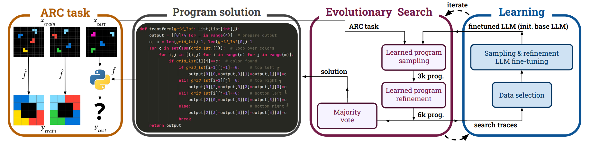

# Self-Improving Language Models for Evolutionary Program Synthesis: A Case Study on ARC-AGI

<p align="center">
          🤗 <a href="https://huggingface.co/collections/julien31/soar-arc-6856d27681fce01d9af4c4a3">Hugging Face (data and model)</a>&nbsp&nbsp | &nbsp&nbsp 📑 <a href="https://icml.cc/virtual/2025/poster/43499">Paper</a> &nbsp&nbsp | &nbsp&nbsp 📑 <a href="https://julienp.netlify.app/posts/soar/">Blog</a>
</p>

Large Language Models (LLMs) have become incredibly powerful, but they often hit a wall when faced with truly complex reasoning tasks that require discovering a solution from scratch. Simply throwing more computing power or using a bigger model often yields diminishing returns. But what if a model could learn from its own experience, getting smarter with every attempt?

We introduce a framework called **SOAR (Self-improving Operators for Automated program Refinements)** that does just that. By creating a "virtuous cycle" of evolutionary search and learning, SOAR enables AI models to bootstrap their own capabilities and solve problems previously beyond their reach. we tested SOAR on the Abstraction and Reasoning Corpus (ARC-AGI-1), a notoriously difficult benchmark designed to challenge an AI's core reasoning abilities. We show that using SOAR with only open weight LLM, we can significantly outperforming much larger closed source LLMs.


We have released a dataset containing 5 million ARC solutions. For solutions that successfully solve an original ARC task, we deduplicate entries by their code to ensure uniqueness. For solutions that correspond to new synthetic tasks generated via hindsight relabeling, we deduplicate based on their output results. This approach ensures a diverse and high-quality dataset for further research and development.

- [soar_arc_train_5M](https://huggingface.co/datasets/julien31/soar_arc_train_5M)


We have also released all five of our SOAR models on Hugging Face:

- [Soar-qwen-7b](https://huggingface.co/julien31/Soar-qwen-7b)
- [Soar-qwen-14b](https://huggingface.co/julien31/Soar-qwen-14b)
- [Soar-qwen-32b](https://huggingface.co/julien31/Soar-qwen-32b)
- [Soar-qwen-72b](https://huggingface.co/julien31/Soar-qwen-72b)
- [Soar-mistral-123b](https://huggingface.co/julien31/Soar-mistral-123b)


## SOAR framework


1.  **Evolutionary Search (Sample & Refine):** SOAR uses an LLM to generate an initial pool of thousands of candidate programs (the "sampling" step). It then tests these programs and uses the LLM again to intelligently modify or "refine" the most promising ones based on their performance.

2.  **Learning from Hindsight:** SOAR takes all the programs generated during the search phase—including both successes and failures—and uses them as training data. The key insight is that any failed program is simply a *correct* program for a *different* task. By "relabeling" these failed attempts as correct solutions for the synthetic tasks they inadvertently solve, SOAR creates a diverse dataset to learn from.

This process creates a powerful feedback loop: the fine-tuned model becomes better at sampling and refining, which leads to a more effective search in the next iteration, which in turn generates even better training data. And unlike previous approaches that rely on human-engineered domain-specific languages or human-generated solutions, SOAR learns to synthesize programs in Python solely from its own synthesis attempts, encompassing both successes and failures.


## info install

### UV inference env
```bash
# Install UV if you haven't already
# curl -LsSf https://astral.sh/uv/install.sh | sh

git clone https://github.com/flowersteam/SOAR
cd SOAR

# Create and activate virtual environment with Python 3.11
uv venv --python 3.11 .venv-inference
source .venv-inference/bin/activate  # On Windows: .venv-inference\Scripts\activate

# Install the package with inference dependencies
uv pip install -e ".[inference]"
```

### UV train env
```bash
# Install UV if you haven't already
# curl -LsSf https://astral.sh/uv/install.sh | sh

git clone https://github.com/flowersteam/SOAR
cd SOAR

# Create and activate virtual environment with Python 3.11
uv venv --python 3.11 .venv-training
source .venv-training/bin/activate  # On Windows: .venv-training\Scripts\activate

# Install PyTorch with CUDA support first
uv pip install torch torchvision torchaudio --index-url https://download.pytorch.org/whl/cu121

# Install the package with training dependencies
uv pip install -e ".[training]"
```

### Alternative: Using UV project management
```bash
# For inference work
uv sync --extra inference
uv run python your_inference_script.py

# For training work  
uv sync --extra training
uv run python your_training_script.py
```

## Run SOAR
To run SOAR, please refer to execution instructions located in the experience folder. 

For simple instructions on running sampling and refinement with SOAR, as well as exploring the dataset, please see the Jupyter notebooks provided in the `notebook` folder. These notebooks walk through the basic SOAR step, including how to generate candidate solutions, perform refinement, and analyze results. This hands-on guide will help you get started quickly and understand each step of the SOAR process.

New details tuto in the `notebook` folder [tuto_expe.md](https://github.com/flowersteam/SOAR/tree/main/experience/tuto_expe.md)


